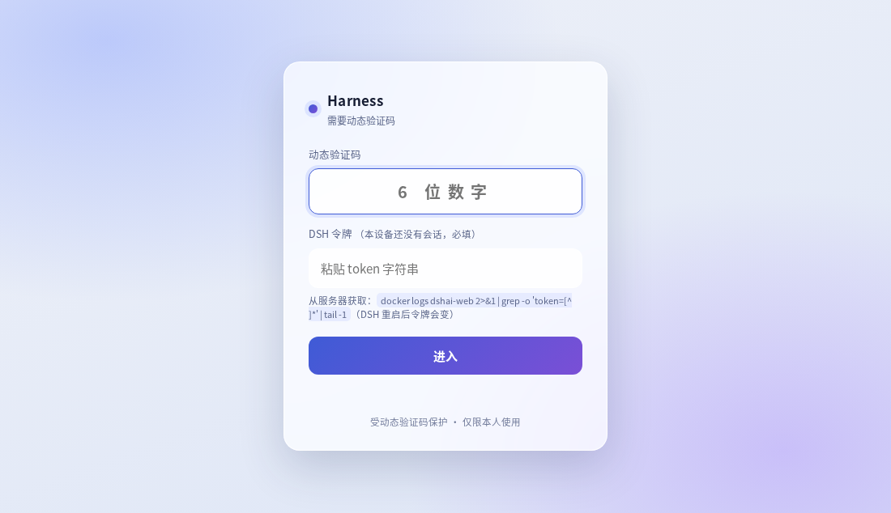

<div align="center">

# dshai-gate

**给 DeepSeek Harness 用的精简反向代理 + 身份门禁**

单个 Go 二进制 · 只用标准库 · 零第三方依赖

[](https://github.com/lyp88997/dshai-gate/releases)
[](LICENSE)
[](https://go.dev)
[](gate/main.go)

把**只肯监听回环**的 DSH，安全地接到公网 —— 顺便把远端访问会踩的四个坑一次填平。



<sub>登录页：动态验证码（TOTP）+ DSH 令牌。已有会话时令牌可留空，没有时会自动变成必填。</sub>

</div>

---

## 目录

- [它解决什么问题](#它解决什么问题)
- [架构](#架构)
- [快速开始](#快速开始)
- [身份门禁](#身份门禁)
- [DSH 令牌自动配对](#dsh-令牌自动配对)
- [配置项](#配置项)
- [常见坑](#常见坑)
- [运维脚本](#运维脚本)
- [安全设计](#安全设计)
- [许可与致谢](#许可与致谢)

## 它解决什么问题

DSH 出于安全考虑**不允许**监听全网卡 —— 那等于把远程代码执行能力交给整个网络：

```console
$ dsh web --host 0.0.0.0
error: --host 0.0.0.0 is intentionally not supported yet for safety:
       it would expose remote code execution to the network; use 127.0.0.1 instead
```

所以远端访问 = **DSH 只监听 127.0.0.1** + **前面加一层反向代理**。
而把 DSH 放到反代后面，会接连撞上四个坑 —— 本项目就是为它们而写：

| # | 现象 | 根因 | 本项目的处理 |
| :-: | --- | --- | --- |
| 1 | 设置 / 插件 / 凭据等接口返回 **403** | DSH 用 Host/Origin 做特权接口围栏（`isTrustedApiRequest`） | **原样透传 Host**，配合官方 `--trusted-host <域名>`。不伪造 Host/Origin —— 伪造会连带引出 Cookie 归属错乱与重定向死循环 |
| 2 | 设置改完**存不住** | 前端按 `location.hostname` 判断"是否本机"，远端被判为非本机，面板退化为内存模式 | 对 `text/html` 注入一行 `window.__DSH_TRANSPORT__={ownsHost:true}` |
| 3 | 长连接**每分钟断开** | nginx 默认 `proxy_read_timeout 60s` 会切断 SSE / WebSocket | 反代设 `proxy_buffering off` + `proxy_read_timeout 3600s`；本服务对 `text/event-stream` 补 `X-Accel-Buffering: no` |
| 4 | 裸反代**没有门禁**，扫描器可白嫖模型额度 | 反代本身不做身份校验 | 内置 TOTP 身份门禁 + 四层防爆破 |

## 架构

```text
              浏览器
                │  https
                ▼
   ┌────────────────────────────┐
   │  nginx / OpenResty / Caddy │   ← TLS、证书、HTTP/2 交给它
   └──────────────┬─────────────┘
                  │ http  127.0.0.1:2299
   ┌──────────────▼─────────────┐
   │        dshai-gate          │   ← 本项目：门禁 · Host 透传 · 注入
   └──────────────┬─────────────┘
                  │ http  127.0.0.1:3082
   ┌──────────────▼─────────────┐
   │   DSH（容器，仅监听回环）   │
   └────────────────────────────┘
```

- `2299` 与 `3082` **都只绑 `127.0.0.1`**，公网不可达
- 本项目**不碰 TLS**：因此没有自签证书、单端口多路复用、子路径适配那类复杂度

## 快速开始

### 1. DSH 以容器运行，并带上 `--trusted-host`

```yaml
command: ["web", "--no-open", "--port", "3082",
          "--trusted-host", "dsh.example.com",
          "--trusted-host", "dsh.example.com:443"]
```

### 2. 下载二进制并运行（作为第二个服务）

```bash
curl -L -o dshai-gate \
  https://github.com/lyp88997/dshai-gate/releases/latest/download/dshai-gate-linux-amd64
chmod +x dshai-gate

GATE_LISTEN=127.0.0.1:2299 \
GATE_UPSTREAM=http://127.0.0.1:3082 \
GATE_TOTP_SECRET=<你的 Base32 密钥> \
GATE_SESSION_SECRET=<32 字节随机 hex> \
./dshai-gate
```

> 也可以用仓库里的 `gate/Dockerfile` 自行构建镜像（多阶段静态编译，产物约 5 MB）。

### 3. 反向代理只需要最普通的这几行

```nginx
location / {
    proxy_pass http://127.0.0.1:2299;
    proxy_http_version 1.1;
    proxy_set_header Host $host;               # 必须原样透传
    proxy_set_header Upgrade $http_upgrade;    # WebSocket
    proxy_set_header Connection $connection_upgrade;
    proxy_buffering off;                       # 流式必需
    proxy_read_timeout 3600s;                  # 长连接必需
}
```

然后打开你的域名，会看到登录页。

## 身份门禁

三种模式，由环境变量决定 —— **一个都不配则拒绝启动**（fail-closed）：

| 模式 | 需要的配置 | 登录方式 |
| --- | --- | --- |
| 口令 | `GATE_PASSWORD_HASH` | 输入口令 |
| 动态码 | `GATE_TOTP_SECRET` | 输入手机 TOTP App 的 6 位码 |
| 双因子 | 两者都配 | 口令 + 动态码 |

- 动态码为标准 **RFC 6238**（HMAC-SHA1 / 30 秒 / 6 位），与 Google Authenticator、Microsoft Authenticator、Aegis、1Password、Bitwarden 等通用
- 会话为服务端 **HMAC 签名 Cookie**：`HttpOnly; Secure; SameSite=Lax`，默认 30 天
- 登录页是单文件内嵌 HTML（**深色玻璃拟态、跟随系统深浅色、6 位码满位自动提交、`autocomplete="one-time-code"` 支持手机自动填码**）

### 防爆破（四层）

| 层 | 规则 |
| --- | --- |
| 单 IP 连败 | 5 次 → 锁 **15 分钟** |
| 单 IP 小时累计 | 20 次 → 锁 **1 小时** |
| 全局限速 | 最近 10 分钟失败越多，响应越慢（上限 4 秒），削弱分布式尝试 |
| 防重放 | 同一时间片用过即作废；且**整轮登录全部成功才记账**，避免「码对了但后续步骤失败」白白浪费一个码 |

每次失败都会记录来源 IP 与剩余可尝试次数。

## DSH 令牌自动配对

DSH 启动时会打印一个一次性配对链接（`http://127.0.0.1:3082/?token=...`）。
本项目把这一步搬进了登录页：**动态码下方有一个「DSH 令牌」输入框**。

| 浏览器状态 | 令牌框行为 |
| --- | --- |
| 已有有效 DSH 会话 | **可留空**，页面会提示（日常就是这种情况） |
| 没有会话（首次 / 换设备 / 换浏览器） | **必填**，填对后由本服务完成换票，并把会话 Cookie 交给浏览器 —— 不用再手工拼带 `?token=` 的网址 |

> ⚠️ DSH 的启动令牌**每次重启都会变**，它不是固定密码。
> 但 DSH 的会话 Cookie 能扛住重启，所以日常并不需要反复输入。
> 取令牌：`docker logs <dsh容器名> 2>&1 | grep -o 'token=[^ ]*' | tail -1`

## 配置项

| 环境变量 | 默认值 | 说明 |
| --- | --- | --- |
| `GATE_LISTEN` | `127.0.0.1:2299` | 监听地址（**务必保持回环**） |
| `GATE_UPSTREAM` | `http://127.0.0.1:3082` | DSH 地址 |
| `GATE_INJECT` | `1` | 是否注入 `ownsHost` |
| `GATE_SITE_TITLE` | `Harness` | 登录页标题 |
| `GATE_SESSION_DAYS` | `30` | 会话有效天数 |
| `GATE_PASSWORD_HASH` | — | `sha256("dshai-gate-v1:" + 口令)` 的 64 位十六进制 |
| `GATE_TOTP_SECRET` | — | Base32 的 TOTP 密钥（可含空格、大小写不敏感） |
| `GATE_SESSION_SECRET` | — | 会话签名密钥，至少 16 字节 |

生成凭据的两个小工具（见 [运维脚本](#运维脚本)）：

```bash
bash scripts/set-totp.sh        # 生成 TOTP 密钥，并先让你在手机上验证一次
bash scripts/set-password.sh    # 设置口令（明文不落盘、不进 shell 历史）
```

## 常见坑

| 现象 | 原因 | 处理 |
| --- | --- | --- |
| 设置面板能打开但**改完不保留** | 上游把 HTML 压缩了，注入没生效 | 本服务已对上游请求 `Accept-Encoding: identity`；若自行改造反代，务必保留这一点 |
| 日志里每分钟一条 `upstream timed out` | 反代没设 `proxy_read_timeout` | 按[第 3 步](#3-反向代理只需要最普通的这几行)补齐 |
| 特权接口 403 | 忘了 `--trusted-host`，或中间层改写了 Host | 让反代 **原样透传 Host**，并把域名加进 `--trusted-host` |
| DSH 容器反复重启 | 数据目录里有容器读不到的条目（文件监听会抛 EACCES） | 起容器前跑 `scripts/perm-guard.sh`，并把备份**放在数据目录之外** |
| 改了凭据后不生效 | 配置改动需要重启本服务 | `docker compose up -d gate`（会话密钥不变则已登录设备不受影响） |
| 把自己锁在门外 | 忘了动态码 / 丢了手机 | 在**服务器上**重跑 `scripts/set-totp.sh` 换新密钥 |

## 运维脚本

| 脚本 | 用途 |
| --- | --- |
| `scripts/selfcheck.sh` | 一键自检：容器健康、门禁是否拦住未授权、登录页是否正确、开放路由是否被挡、旧实例状态 |
| `scripts/perm-guard.sh` | **起容器前必跑**：检查数据目录里有没有容器读不到的条目（否则 DSH 崩溃重启） |
| `scripts/set-password.sh` | 设置 / 更换口令 |
| `scripts/set-totp.sh` | 生成 TOTP 密钥；**先验证一次再写配置**，避免把自己锁在门外 |
| `scripts/verify-totp.py` | 独立校验某个 TOTP 密钥与 6 位码是否匹配 |
| `scripts/rollback.sh` | 回滚（可只停门禁，或停整套；不动数据） |

## 安全设计

- **fail-closed**：没有任何认证配置时**拒绝启动**（宁可 502，也不留一扇没锁的门）
- **只绑回环**：`GATE_LISTEN` 默认 `127.0.0.1`，不要改成 `0.0.0.0`
- **密钥只从环境变量注入**：仓库与镜像里不含任何凭据；`.gitignore` 也挡掉了 `.env`、初始口令文件、数据目录
- **不伪造请求头**：Host / Origin / Sec-Fetch-* 一律原样透传，因此不存在 Cookie 归属漂移与重定向死循环
- **不做多余的事**：不实现用户系统、不做 OAuth、不引入数据库 —— 一台机器一个人，够用即可

## 许可与致谢

MIT © 2026 lyp88997

反代适配的思路（尤其是「特权接口 403」「前端 isLoopback」「子路径与长连接」这几类坑）参考了
[yuexps/deepseek.harness.fnos](https://github.com/yuexps/deepseek.harness.fnos) 的
`REVERSE_PROXY_ADAPTATION.md`。

本仓库代码为**独立重写**：不含 fnOS 网关的子路径适配、不伪造 Host/Origin、
不含自动换票的防环逻辑（改用官方 `--trusted-host` + 一次性配对），
因此代码量约为其反代部分的 1/6。
