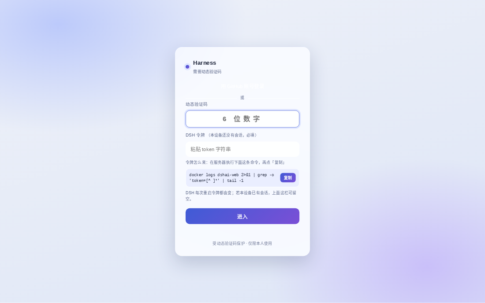
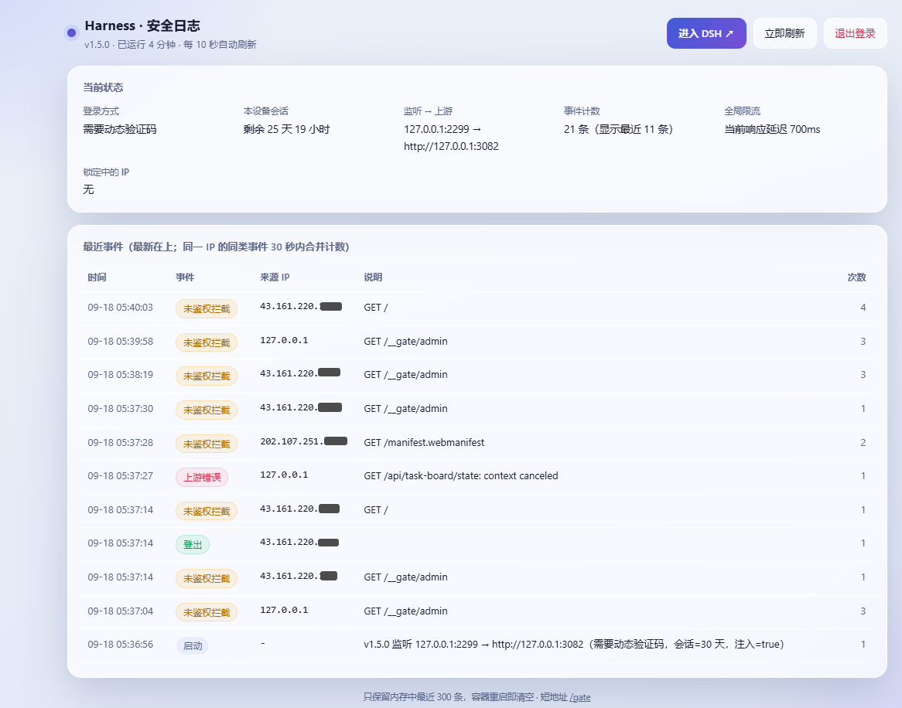

<div align="center">

# dshai-gate

**给 DeepSeek Harness 用的精简反向代理 + 身份门禁**

单个 Go 二进制 · 只用标准库 · 零第三方依赖

[](https://github.com/lyp88997/dshai-gate/releases)
[](LICENSE)
[](https://go.dev)
[](gate/main.go)

把**只肯监听回环**的 DSH，安全地接到公网 —— 顺便把远端访问会踩的五个坑一次填平。



<sub>登录页（1.7.3 实拍）：上面是按需出现的 GitHub 登录按钮，下面是动态验证码（TOTP）与 DSH 令牌。已有会话时令牌可留空，没有时会自动变成必填。</sub>

</div>

---

## 目录

- [它解决什么问题](#它解决什么问题)
- [架构](#架构)
- [快速开始](#快速开始)
- [身份门禁](#身份门禁)
- [DSH 令牌自动配对](#dsh-令牌自动配对)
- [安全日志与后台页](#安全日志与后台页)
- [配置项](#配置项)
- [常见坑](#常见坑)
- [运维脚本](#运维脚本)
- [安全设计](#安全设计)
- [许可与致谢](#许可与致谢)

## 它解决什么问题

DSH 出于安全考虑**不允许**监听全网卡 —— 那等于把远程代码执行能力交给整个网络：

```console
$ dsh web --host 0.0.0.0
error: --host 0.0.0.0 is intentionally not supported yet for safety:
       it would expose remote code execution to the network; use 127.0.0.1 instead
```

所以远端访问 = **DSH 只监听 127.0.0.1** + **前面加一层反向代理**。
而把 DSH 放到反代后面，会接连撞上五个坑 —— 本项目就是为它们而写：

| # | 现象 | 根因 | 本项目的处理 |
| :-: | --- | --- | --- |
| 1 | 设置 / 插件 / 凭据等接口返回 **403** | DSH 用 Host/Origin 做特权接口围栏（`isTrustedApiRequest`） | **原样透传 Host**，配合官方 `--trusted-host <域名>`。全局改写 Host 会引出 Cookie 归属错乱与重定向死循环，故默认不动它（唯一例外见第 5 行） |
| 2 | 设置改完**存不住** | 前端按 `location.hostname` 判断"是否本机"，远端被判为非本机，面板退化为内存模式 | 对 `text/html` 注入一行 `window.__DSH_TRANSPORT__={ownsHost:true}` |
| 3 | 长连接**每分钟断开** | nginx 默认 `proxy_read_timeout 60s` 会切断 SSE / WebSocket | 反代设 `proxy_buffering off` + `proxy_read_timeout 3600s`；本服务对 `text/event-stream` 补 `X-Accel-Buffering: no` |
| 4 | 裸反代**没有门禁**，扫描器可白嫖模型额度 | 反代本身不做身份校验 | 内置 TOTP 身份门禁 + 四层防爆破 |
| 5 | 任务看板 / 技能中心 / 用量统计 / 配置管理器 / 自由搜索设置 / **插件市场（dshmarket 1.56.0+）** 等**插件接口 403、400** | 这几个插件把接口**自己**围栏成 loopback-only（要求 `Host` 必须是 `127.0.0.1` / `localhost`）—— `--trusted-host` 是 DSH 的放行名单，管不到插件**自己**这道围栏 | 只对**点名**的接口**定向呈现回环身份**（Host 与 Origin 同步改写），其余路径一律保持原样：纯 API 插件走 `loopbackOnlyPrefixes`（前缀，**同时**要求有有效 DSH 会话），插件市场走 `marketMutationPaths`（**精确匹配**，见[常见坑](#常见坑)） |

## 架构

```text
              浏览器
                │  https
                ▼
   ┌────────────────────────────┐
   │  nginx / OpenResty / Caddy │   ← TLS、证书、HTTP/2 交给它
   └──────────────┬─────────────┘
                  │ http  127.0.0.1:2299
   ┌──────────────▼─────────────┐
   │        dshai-gate          │   ← 本项目：门禁 · Host 透传 · 定向回环 · 注入
   └──────────────┬─────────────┘
                  │ http  127.0.0.1:3082
   ┌──────────────▼─────────────┐
   │   DSH（容器，仅监听回环）   │
   └────────────────────────────┘
```

- `2299` 与 `3082` **都只绑 `127.0.0.1`**，公网不可达
- 本项目**不碰 TLS**：因此没有自签证书、单端口多路复用、子路径适配那类复杂度

## 快速开始

### 1. DSH 以容器运行，并带上 `--trusted-host`

```yaml
command: ["web", "--no-open", "--port", "3082",
          "--trusted-host", "dsh.example.com",
          "--trusted-host", "dsh.example.com:443"]
```

### 2. 下载二进制并运行（作为第二个服务）

```bash
curl -L -o dshai-gate \
  https://github.com/lyp88997/dshai-gate/releases/latest/download/dshai-gate-linux-amd64
chmod +x dshai-gate

GATE_LISTEN=127.0.0.1:2299 \
GATE_UPSTREAM=http://127.0.0.1:3082 \
GATE_TOTP_SECRET=<你的 Base32 密钥> \
GATE_SESSION_SECRET=<32 字节随机 hex> \
./dshai-gate
```

> 也可以用仓库里的 `gate/Dockerfile` 自行构建镜像（多阶段静态编译，产物约 5 MB）。

### 3. 反向代理只需要最普通的这几行

```nginx
location / {
    proxy_pass http://127.0.0.1:2299;
    proxy_http_version 1.1;
    proxy_set_header Host $host;               # 必须原样透传
    proxy_set_header Upgrade $http_upgrade;    # WebSocket
    proxy_set_header Connection $connection_upgrade;
    proxy_buffering off;                       # 流式必需
    proxy_read_timeout 3600s;                  # 长连接必需
}
```

然后打开你的域名，会看到登录页。

## 身份门禁

三种模式，由环境变量决定 —— **一个都不配则拒绝启动**（fail-closed）：

| 模式 | 需要的配置 | 登录方式 |
| --- | --- | --- |
| 口令 | `GATE_PASSWORD_HASH` | 输入口令 |
| 动态码 | `GATE_TOTP_SECRET` | 输入手机 TOTP App 的 6 位码 |
| 双因子 | 两者都配 | 口令 + 动态码 |
| GitHub | 后台页配置（见下） | 「用 GitHub 账号登录」按钮 |

- 动态码为标准 **RFC 6238**（HMAC-SHA1 / 30 秒 / 6 位），与 Google Authenticator、Microsoft Authenticator、Aegis、1Password、Bitwarden 等通用
- 会话为服务端 **HMAC 签名 Cookie**：`HttpOnly; Secure; SameSite=Lax`，默认 30 天
- 登录页是单文件内嵌 HTML（**深色玻璃拟态、跟随系统深浅色、6 位码满位自动提交、`autocomplete="one-time-code"` 支持手机自动填码、取令牌命令一键复制**）；1.7.3 起前景色与底色**成对定义**（浅色偏好下不再出现白字白底），并补了窄屏与「减少动态效果」两段媒体查询
- **1.7.0 起，动态码开关与 GitHub 登录可以在后台页里改**，不用进服务器改环境变量；**关掉的登录方式在前台登录页会自动隐藏**（没有动态码就不显示那个输入框，没有 GitHub 就不显示那个按钮）

### 防爆破（四层）

| 层 | 规则 |
| --- | --- |
| 单 IP 连败 | 5 次 → 锁 **15 分钟** |
| 单 IP 小时累计 | 20 次 → 锁 **1 小时** |
| 全局限速 | 最近 10 分钟失败越多，响应越慢（上限 4 秒），削弱分布式尝试 |
| 防重放 | 同一时间片用过即作废；且**整轮登录全部成功才记账**，避免「码对了但后续步骤失败」白白浪费一个码 |

每次失败都会记录来源 IP 与剩余可尝试次数。

### 会话失效时会怎样

门禁会话（默认 30 天）和 DSH 自己的会话是**两个独立时钟**，谁短谁先死：

| 情况 | 行为 |
| --- | --- |
| 浏览器清掉了 Cookie / 站点数据 | 两个 Cookie 一起消失 → 直接回登录页，且「DSH 令牌」框**自动变必填** |
| 只清了缓存、Cookie 还在 | 无影响 |
| **门禁会话还在、DSH 会话已失效**（DSH 重启 / 轮换 / 各自过期） | 打开页面时若上游回 **401**，门禁**就地**把文档导航换成登录页（不是重定向，URL 与 `next` 保持原样）；XHR / SSE 仍拿 401 原文，不会被塞进 HTML |
| 会话在**页面已经开着**时失效 | 标签页里的请求继续 401、停在报错态 —— **按一次刷新**即回登录页 |
| 门禁记的 DSH 会话**过了 `GATE_DSH_SESSION_DAYS`**（默认 30 天） | 回登录页，填一次 DSH 令牌即可（也可在后台页的「DSH 会话」卡里直接配对，不用重走登录） |

> 为什么不做「自动跳」：那要侵入 DSH 运行时（改写全局 `fetch` / XHR），
> 而插件自己对合法会话回 401 时会被误伤成刷新循环。刷新一下的成本远低于这个风险。

## DSH 令牌自动配对

DSH 启动时会打印一个一次性配对链接（`http://127.0.0.1:3082/?token=...`）。
本项目把这一步搬进了登录页：**动态码下方有一个「DSH 令牌」输入框**。

| 浏览器状态 | 令牌框行为 |
| --- | --- |
| 已有有效 DSH 会话 | **可留空**，页面会提示（日常就是这种情况） |
| 没有会话（首次 / 换设备 / 换浏览器） | **必填**，填对后由本服务完成换票，并把会话 Cookie 交给浏览器 —— 不用再手工拼带 `?token=` 的网址 |

> ⚠️ DSH 的启动令牌**每次重启都会变**，它不是固定密码。
> 但 DSH 的会话 Cookie 能扛住重启，所以日常并不需要反复输入。
> 取令牌：`docker logs <dsh容器名> 2>&1 | grep -o 'token=[^ ]*' | tail -1`

登录页把这条命令做成了**可点击复制的代码块**：点「复制」即整条入剪贴板（点代码本身也行），
省得手抄 —— 容器名按你的实际情况改一下即可。

## 安全日志与后台页

门禁把最近的安全事件记在内存里（最多 300 条），通过两个地址查看：

| 地址 | 用途 |
| --- | --- |
| `/gate` | 短地址，跳转到后台页 |
| `/__gate/admin` | 后台页本体，受同一套会话 Cookie 保护（未登录先跳登录页） |

后台页有这些内容（页面从上到下就是这个顺序）：

- **页头那一行按钮**（固定在顶部，**1.7.1 起**）：**`重启 DSH`**、`自动刷新` 勾选框、`进入 DSH ↗`、`立即刷新`、`退出登录`。
  重启按钮放这里是因为它是最常按的一个；按下后状态就写在页头紧下面那一行（`可重启 / 重启进行中` + 最近一次发起 + 结果）
- **当前状态**：登录方式、本设备会话剩余时间、监听 → 上游、事件计数、全局限流延迟、锁定中的 IP
- **登录方式**：三种方式各显示「已开启 / 已关闭 / 没配置」，可在这里**开 / 关动态验证码**（关掉后登录页立即不再显示动态码输入框）
- **GitHub 登录（手动配置）**：填 client id / client secret / 允许的账号，保存即生效（见下）。
  **没配好时默认展开**（要你照着填），**配好之后自动折叠**（1.7.1 起）成一行「已配置（开启中），点这一行改」，要改再点开
- **DSH 会话**：本机 DSH 会话的有效期与剩余时间，过期或「没有记录」时把 DSH 令牌粘进去点「配对并登录」即可
- **最近事件**：时间 / 事件 / 来源 IP / 说明 / 次数。**1.7.0 起默认收起**，点标题行展开、再点收起，展开状态记在浏览器里；
  展开后有 `全部` / `只看异常（失败 / 拦截）` 两个筛选，以及一行统计（失败 / 拦截 / 成功 / 其他各多少条，**1.7.1 起**）；
  页头有「自动刷新」勾选框（默认**关**；勾上后每 10 秒刷新，正在填表时自动跳过，不会把你填了一半的内容刷掉）

#### 日志怎么做到「扫不爆」

扫描器打过来会刷出成千上万条事件，门禁用三层收窄，**只影响怎么显示，不影响记录**：

| 层 | 规则 | 挡什么 |
| --- | --- | --- |
| 合并 | 同一 IP 的**同类**事件在 30 秒内并成一条、`次数` 累加（中间夹了别的事件也照样并回最近那一条，不是只比队尾） | 一台机器反复打同一件事 |
| 限速 | 标准输出（`docker logs`）每 10 秒最多打 30 行新事件，超出的在窗口结束时汇总成一行「另有 N 条没往标准输出打」 | **分布式**扫描（每个新 IP 都是一条新事件，合并对它无效） |
| 渲染上限 | 后台页一次只渲染最新 100 行（内存里留 300 条） | 页面每 10 秒自动刷新，300 行塞进 DOM 纯属浪费 |

统计数字（`拦截 N` 等）统计的是**内存里的全部事件**，跟渲染上限和「只看异常」筛选都无关 ——
所以不会出现「旧记录被挤出页面、看着像攻击停了」。转发日志历史请用 `docker logs dshai-gate`，
但记住标准输出本身也是有上限的（否则正好是被刷爆的那个地方）。

### 用 GitHub 账号登录（可选，1.7.0 起）

嫌动态码麻烦、又不想降低安全性时用这条路：**用 GitHub 账号替代动态验证码**，
进后台的第一道门由 GitHub 把关，且只有你点名的账号能进。

在 GitHub 上建一个 OAuth App（**Settings → Developer settings → OAuth Apps → New OAuth App**）：

| 字段 | 填什么 |
| --- | --- |
| Application name | 随便，如 `dshai-gate` |
| Homepage URL | 你的域名，如 `https://harness.example.com` |
| Authorization callback URL | **后台页「GitHub 登录」卡里显示的地址**，形如 `https://你的域名/__gate/oauth/github/callback` —— 照抄，别手打 |

拿到 `Client ID` 与 `Client secret` 后，回到后台页「GitHub 登录（手动配置）」卡里填三项并保存：

- **Client ID / Client secret**：上一步拿到的两个值（secret 留空 = 不修改；**页面不会回显已保存的 secret**）
- **允许的账号**：GitHub 用户名或数字 ID，逗号分隔（如 `lyp88997, 12345`）

保存后：

1. 登录页出现「用 GitHub 账号登录」按钮；
2. 回后台页把**动态验证码关掉**（「登录方式」卡里的开关）—— 现在这个决定是安全的，因为 GitHub 那道门已经能用了；
3. 关掉后登录页的动态码输入框**自动消失**。

> ⚠️ 门禁**不允许**把三种方式全关掉：如果关掉动态码之后一种能用的登录方式都不剩（比如 GitHub 没配全），
> 后台会**拒绝这次修改**并用红条提示原因 —— 免得把自己锁在门外。
>
> ⚠️ GitHub 的 **client secret 存在服务器上的状态文件里**（`GATE_STATE`，权限 600），
> **不是**放在 compose 的 `environment` 里 —— 后者 `docker inspect` 就能看到。
> 目录不可写时门禁**不会挂**，只会降级成「改动只在内存里、重启丢失」，后台页会显示提醒。

> **为什么必须配上真能用的 GitHub 登录才允许关动态码**：动态码是「你已经配好的那把锁」。
> 允许在没有第二把锁的情况下卸掉它，等于一句配置就把门开着。

### 重启 DSH

装了插件、改了配置需要重启才生效时，用后台页**页头**的 `重启 DSH` 按钮，不必登服务器。

- 按钮由门禁**以回环身份**调用 DSH 自己的重启接口（`POST /dsh-market/restart`），
  并轮询确认它真的停下又起来，结果写在页头下面那一行（勾上「自动刷新」，重启期间盯着看即可）。
- ⚠️ **本服务的 compose 必须是 `restart: unless-stopped`。** DSH 收到停止信号是
  **优雅退出、退出码 0**，而 `restart: on-failure` 只认非 0 退出码 —— 用 on-failure 时
  点一次重启就等于**把服务彻底停掉**（本仓库 compose.yaml 因此用 `unless-stopped`）。
- 这条路依赖 dshmarket 插件已加载（重启路由由它注册）。DSH 完全起不来时按钮也救不了，
  那种情况要登服务器用 `docker compose up -d` 拉。
- 同一时刻只允许一个重启在跑；按钮要求已登录（与后台页同一套会话 Cookie），
  并额外做**同源校验**（`Sec-Fetch-Site` 优先，缺省时比对 `Origin` 与 `Host`）。
  会话 Cookie 是 `SameSite=Lax`，跨站表单本来就带不上；同源校验是纵深防御。

> **为什么门禁反代要擦转发头**：市场自己那道「无转发头 = 本机直连」的严门会把经反代来的
> 合法请求一律 403，于是市场横幅上的「立即重启」按钮原先永远失败。门禁只对**两条精确路径**
> （`/dsh-market/restart`、`/dsh-market/api/v1/restart`）擦掉 `X-Forwarded-For` / `X-Real-IP` /
> `Forwarded`，不动 Host / Origin。
>
> ⚠️ **这里绝不能用前缀 `/dsh-market/` 一把梭。** 市场把「重启 / 导出配置 / 自卸载」放在
> **同一道严门**后面，而那些接口**不要求 DSH 会话**——它们的唯一访问控制就是这道门。
> 用前缀放行的实测后果是：**只带门禁会话**就能下载 profile 配置（市场自己把
> `pnpm-workspace.yaml` 列为「常含凭据」）、自卸载市场插件，把「门禁 + DSH 令牌」的
> 双层模型压成一层。只列重启这两条即可（它们的唯一能力就是重启）。
> 市场里「下载配置备份」「自卸载」两个按钮经门禁仍是 403，这是**有意保留**的。
> 探针第 ⑦⑨ 项就守着这条线。
>
> **1.5.4 起，插件市场的写操作另走一张精确表。** dshmarket 1.56.0（上游 commit `9be13bf`，
> 修 #678 DNS rebinding）给 `sameOrigin` 加了 `loopbackAuthority(host)`：Host 必须是
> `127.0.0.1` / `localhost` / `[::1]`，于是经门禁（Host 为域名）时**安装 / 卸载 / 更新 /
> 启停全部 403 `untrusted origin`**（1.55.0 只比对 `Origin == Host`，所以此前一直正常）。
> 门禁为此新增 `marketMutationPaths`：20 条**精确**路由，只呈现回环身份，**绝不用前缀**。
> 刻意排除的仍是「重启 / 导出配置 / 快照 / Gist / WebDAV / 自卸载」。
>
> **1.7.2 起，应用市场客户端（`@linxin666/dsh-client-ui-market`）另有一条前缀白名单。**
> 它注册的是 `/api/market/`（列已安装、装皮肤 / 预设 / 宠物），围栏写在
> `isLoopbackRequest`（socket 与 Host 都必须是回环），但**不校验 DSH 会话**，
> 所以和配置管理器 / 自由搜索设置一样走「前缀 + 第二层」。它与上面那张
> `/dsh-market/` 精确表是**两个不同的插件**，别混。探针第 ⑫ 项守着它。

> 📷 下图为 1.7.2 生产实拍：重启按钮在页头右上角，GitHub 卡配好后默认折叠成一行，安全事件默认收起。



**降噪**：同一 IP 的同类事件在 30 秒内合并为一条并累加次数，页面显示累计次数；
标准输出只在新建条目时打印一行，不会把 `docker logs` 刷爆。**1.7.1 起再加一道闸**：
任意 10 秒最多往标准输出打 30 行，超出的**不丢**（内存里照记、后台页照显示），
只在窗口结束时补一行汇总说明压掉了多少条。页面上的统计口径是**全部事件**，
不是页面上看得见的那几行。

> ⚠️ 事件只存在内存里（最多 300 条），**容器重启即清空**。
> 同一份事件也会写到标准输出，可用 `docker logs <容器名>` 回看（受 Docker 日志轮转限制）；
> 需要长期留存请接外部日志采集。

## 配置项

| 环境变量 | 默认值 | 说明 |
| --- | --- | --- |
| `GATE_LISTEN` | `127.0.0.1:2299` | 监听地址（**务必保持回环**） |
| `GATE_UPSTREAM` | `http://127.0.0.1:3082` | DSH 地址 |
| `GATE_INJECT` | `1` | 是否注入 `ownsHost` |
| `GATE_SITE_TITLE` | `Harness` | 登录页标题 |
| `GATE_SESSION_DAYS` | `30` | 门禁会话有效天数 |
| `GATE_DSH_SESSION_DAYS` | `30` | 门禁记住的 **DSH 会话**有效天数。超期后回登录页要求重新填一次 DSH 令牌（把 DSH 启动令牌的寿命从「永久」收回到可控范围） |
| `GATE_STATE` | `/data/state.json` | 后台页会改的配置（GitHub client id/secret、动态码开关）落盘位置。**目录必须可写**（镜像内以 65534 运行）；不可写则降级为仅内存 + 告警 |
| `GATE_GITHUB_OAUTH_BASE` | `https://github.com` | GitHub OAuth 端点前缀（仅测试 / 自建代理时才需要改） |
| `GATE_GITHUB_API_BASE` | `https://api.github.com` | GitHub API 端点前缀（同上） |
| `GATE_PASSWORD_HASH` | — | `sha256("dshai-gate-v1:" + 口令)` 的 64 位十六进制 |
| `GATE_TOTP_SECRET` | — | Base32 的 TOTP 密钥（可含空格、大小写不敏感） |
| `GATE_SESSION_SECRET` | — | 会话签名密钥，至少 16 字节 |
| `TZ` | `Asia/Shanghai`（compose 默认） | 日志与后台页时间用的时区。本服务镜像基于 alpine、**没有 zoneinfo**，时区库是编译进二进制的（`_ "time/tzdata"`），所以独立二进制也生效；不设则退回 UTC |

生成凭据的两个小工具（见 [运维脚本](#运维脚本)）：

```bash
bash scripts/set-totp.sh        # 生成 TOTP 密钥，并先让你在手机上验证一次
bash scripts/set-password.sh    # 设置口令（明文不落盘、不进 shell 历史）
```

## 常见坑

| 现象 | 原因 | 处理 |
| --- | --- | --- |
| 设置面板能打开但**改完不保留** | 上游把 HTML 压缩了，注入没生效 | 本服务已对上游请求 `Accept-Encoding: identity`；若自行改造反代，务必保留这一点 |
| 日志里每分钟一条 `upstream timed out` | 反代没设 `proxy_read_timeout` | 按[第 3 步](#3-反向代理只需要最普通的这几行)补齐 |
| 特权接口 403 | 忘了 `--trusted-host`，或中间层改写了 Host | 让反代 **原样透传 Host**，并把域名加进 `--trusted-host` |
| 插件面板接口 **403 / 400**（任务看板、技能中心、用量统计、配置管理器、自由搜索设置…） | 该插件把接口围栏成 loopback-only，而 `--trusted-host` 管不到插件自己的围栏 | 把它的接口前缀加进 `gate/main.go` 的 `loopbackOnlyPrefixes`，**并把前缀同时加进 `sessionRequiredPrefixes`**（见下一行），重建后用 `scripts/gate-probe.sh` 回归 |
| 加了前缀之后，**只带门禁会话、不带 DSH 令牌也能调**那些接口 | 有些插件接口族**不带 DSH 会话也返回 200**（配置管理器、自由搜索设置就是如此），它们的唯一门就是 loopback 围栏；门禁呈现回环身份等于把两层压成一层 | 前缀要同时进 `sessionRequiredPrefixes`，由门禁第二层补上「需要有效的 DSH 会话」。1.7.0 起 `/api/dsh-ssh/`、`/api/dsh-config-manager/`、`/api/dsh-free-search-settings/` 都走这条线，**1.7.2 起又加上了 `/api/market/`（应用市场客户端）**，探针第 ⑪ / ⑫ 项守着它们 |
| **插件市场里安装 / 卸载 / 更新 / 启停全部 403 `untrusted origin`** | dshmarket **1.56.0** 起 `sameOrigin` 要求 Host 是回环；1.55.0 只比对 `Origin == Host`，所以此前正常 | 把**精确**路由加进 `gate/main.go` 的 `marketMutationPaths`（**不要**用前缀 `/dsh-market/`）。1.5.4 起已内置，探针第 ⑧ 项守着它 |
| DSH 容器反复重启 | 数据目录里有容器读不到的条目（文件监听会抛 EACCES） | 起容器前跑 `scripts/perm-guard.sh`，并把备份**放在数据目录之外** |
| 改了凭据后不生效 | 配置改动需要重启本服务 | `docker compose up -d gate`（会话密钥不变则已登录设备不受影响） |
| **页面突然点不动、接口全 401，但登录页本身还能开** | 门禁会话还有效，DSH 自己那层已经失效 | 刷新页面 → 回到登录页 → 填 DSH 令牌重新配对（1.6.0 起导航会自动回登录页，见[会话失效时会怎样](#会话失效时会怎样)） |
| 日志里**所有**「上游错误」的 IP 都是 `127.0.0.1` | 1.6.0 之前记的是**出站**请求，其 `X-Forwarded-For` 末尾是 nginx 自己 | 升级到 1.6.0（已改为用入站请求取 IP，安全日志才有归因） |
| 后台页与日志时间比本地**早 8 小时** | 容器时区是 UTC，且镜像里没有 zoneinfo | 1.6.0 起时区库已内嵌，设 `TZ`（compose 默认 `Asia/Shanghai`）即可 |
| 系统是**浅色**偏好时，登录页上的按钮**白字看不见** | 样式只给了 `color` 没给 `background`（旧版 `@media (prefers-color-scheme: light){a.go{color:#fff}}` 就是如此），白字直接压在白卡片上，对比度 1:1 | 1.7.3 起前景/底色成对写（`color:var(--fg)` 配 `background:var(--surface)`），浅色实测 14.99:1；`main_test.go` 的 `TestLoginGithubButtonCarriesOwnColors` 会在只给颜色时让测试失败 |
| 把自己锁在门外 | 忘了动态码 / 丢了手机 | 在**服务器上**重跑 `scripts/set-totp.sh` 换新密钥；若已配好 GitHub 登录，也可用 GitHub 账号进去 |
| 后台页改了设置（GitHub 配置、动态码开关），**重启后又变回去** | `GATE_STATE` 所在目录容器写不进去（镜像内以 65534 运行） | 宿主上 `mkdir -p /opt/dshai/gate-data && chown 65534:65534 /opt/dshai/gate-data`，再重建门禁容器；后台页会显示「改动只在内存里生效」的提醒 |
| 想关掉动态码，后台却拒绝并提示「没改」 | 关掉之后一种能用的登录方式都不剩（GitHub 没配全 / 没填白名单） | 先把 GitHub 登录配全并验证能进，再关动态码 —— 这是有意为之 |

## 运维脚本

| 脚本 | 用途 |
| --- | --- |
| `scripts/selfcheck.sh` | 一键自检：容器健康、门禁是否拦住未授权、登录页是否正确、开放路由是否被挡、旧实例状态 |
| `scripts/gate-probe.sh` | **门禁链路探针**：自签会话走完整链路，逐项验证插件接口 200、核心接口未受影响、未登录仍是 401、后台页与 `/gate` 短地址正常，另有 ⑥ X-Forwarded-For 信任方向、⑦ 市场围栏是否恢复（`/dsh-market/backup` 应 403、`/dsh-market/status` 应 200）、⑧ 市场变更路由已放行（应回业务错误 400 而非 403）、⑨ 排除清单仍被挡（`backup` / `self-uninstall` 应 403）、⑩ DSH 会话失效时导航回登录页而 XHR 仍是 401、**⑪ 1.7.0 新增的两个前缀（配置管理器 / 自由搜索设置）经门禁不再被插件 403，且无 DSH 会话时被第二层拦成 403**、**⑫ 1.7.2 新增的 `/api/market/`（应用市场客户端）同上，且该族不带 DSH 会话时确实返回 200（所以第二层不是多余的）**。**改过 `loopbackOnlyPrefixes` / `sessionRequiredPrefixes` / `marketMutationPaths` / `processControlPaths` / `clientIP` / `ModifyResponse` 后必跑**；也可带一个公网 URL 参数，走 nginx 做全链路回归 |
| `scripts/perm-guard.sh` | **起容器前必跑**：检查数据目录里有没有容器读不到的条目（否则 DSH 崩溃重启） |
| `scripts/set-password.sh` | 设置 / 更换口令。**只改自己那两个键**，保留 `.env` 里其它配置（1.6.0 前用截断重写，会把 TOTP 密钥一起抹掉 → 静默从双因子降级成单口令） |
| `scripts/set-totp.sh` | 生成 TOTP 密钥；**先验证一次再写配置**，避免把自己锁在门外 |
| `scripts/verify-totp.py` | 独立校验某个 TOTP 密钥与 6 位码是否匹配 |
| `scripts/rollback.sh` | 回滚（可只停门禁，或停整套；不动数据） |
| `cd gate && go vet ./... && go test ./...` | **单元测试**（1.7.1 起）：安全日志的合并规则（含交错合并）、标准输出的每窗口限速与汇总行、配色分类、渲染上限与「统计覆盖全部事件」的口径。**改过 `secNote` / `outDecision` / `toneOf` / `buildRows` 后必跑** |

## 安全设计

- **fail-closed**：没有任何认证配置时**拒绝启动**（宁可 502，也不留一扇没锁的门）
- **只绑回环**：`GATE_LISTEN` 默认 `127.0.0.1`，不要改成 `0.0.0.0`
- **密钥只从环境变量或权限 600 的状态文件注入**：仓库与镜像里不含任何凭据；`.gitignore` 也挡掉了 `.env`、初始口令文件、数据目录与 `gate-data/`。GitHub 的 client secret **绝不放进 compose 的 `environment`** —— 那会被 `docker inspect` 原样看到
- **不伪造请求头**：Host / Origin / Sec-Fetch-* **默认**一律原样透传，因此不存在 Cookie 归属漂移与重定向死循环。三处例外：`loopbackOnlyPrefixes`（纯 API 插件接口，前缀匹配；含 `.`/`..` 段的路径**不**给身份，因为上游会把它归一化成别的路径，等于给白名单开后门）、`marketMutationPaths`（插件市场的 20 条**精确**变更路由——用精确匹配而不是前缀，是因为实测 `/dsh-market/backup` 与 `/dsh-market/logs` **不带任何 DSH 会话**就能读到 profile 配置与日志，前缀一把梭会把「门禁 + DSH 令牌」压成一层），以及 `processControlPaths`（两条精确重启路径，只**擦掉** `X-Forwarded-For` / `X-Real-IP` / `Forwarded`；1.5.4 起这两条同时也要回环身份，因为 `trustedRestartRequest` 除了「无转发头」还要求回环 Host）
- **按 IP 防爆破只信最后一跳**：`clientIP()` 取 `X-Forwarded-For` 的**最后一个**非空值。上游 nginx 用 `$proxy_add_x_forwarded_for`，语义是「客户端自带值 + 真实 IP」；取第一个等于把攻击者随手写的字符串当成客户端身份，按 IP 锁定会被每次换个伪造值绕过
- **会话失效就地换登录页，不重定向**：只对「上游 **401** + 文档导航（`wantsHTML`）+ 复核确认没有 DSH 会话」生效。换成 302 会被 XHR 自动跟随，等于把 HTML 喂给 JSON 解析器；那次复核探测让规则只认真正的会话失效，插件对合法会话回的 401 不会被误伤
- **日志归因一律用入站请求**：`Rewrite` 把入站请求存进出站请求的 context，`ErrorHandler` 与响应体包装都从那里取 IP 和路径。出站请求的 `X-Forwarded-For` 末尾是 nginx 自己，直接用会把所有上游错误记成同一个 `127.0.0.1`
- **回环身份永远配一条第二层**：对插件 loopback 围栏呈现回环身份的前缀，同时要求「有效的 DSH 会话」（`sessionRequiredPrefixes`）。有些插件接口族**不带 DSH 会话也返回 200**（配置管理器、自由搜索设置就是如此），只呈现身份等于把「门禁 + DSH 令牌」压成一层
- **GitHub 登录只认白名单**：非白名单账号 403，且**绝不下发门禁 Cookie**；GitHub-only 模式下即使只提交 DSH 令牌，也只换 DSH 会话、**不发门禁 Cookie**。OAuth 用一次性 `state` 票据（HMAC 签名，10 分钟作废）防 CSRF
- **不做多余的事**：不实现用户系统、不引入数据库、不引第三方依赖 —— 一台机器一个人，够用即可（GitHub 登录只用两三个 HTTP 端点，标准库直连）

## 许可与致谢

MIT © 2026 lyp88997

反代适配的思路（尤其是「特权接口 403」「前端 isLoopback」「子路径与长连接」这几类坑）参考了
[yuexps/deepseek.harness.fnos](https://github.com/yuexps/deepseek.harness.fnos) 的
`REVERSE_PROXY_ADAPTATION.md`。

本仓库代码为**独立重写**：不含 fnOS 网关的子路径适配、不伪造 Host/Origin（仅对 loopback-only 插件接口定向呈现回环身份）、
不含自动换票的防环逻辑（改用官方 `--trusted-host` + 一次性配对），
因此代码量约为其反代部分的 1/6。
